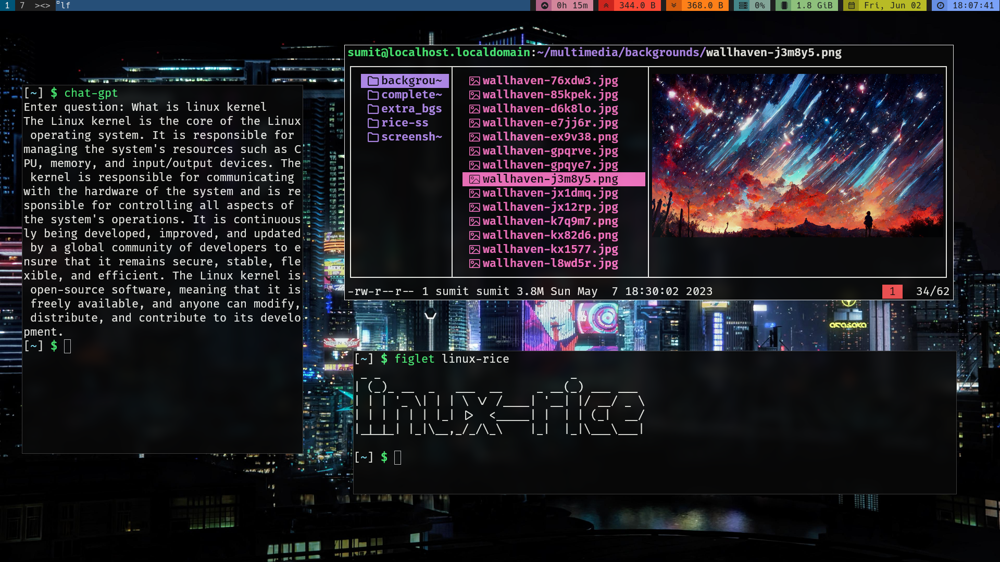

# Linux X-Server Setup, Config & Scripts

These repository contains scripts and configuration files of those applications which I used to rice linux:

| Applications            | Packages                |
| :---------------------- | :---------------------- |
| shell                   | zsh                     |
| display_server		      | x                       |
| compositor			        | picom                   |
| window_manager          | dwm                     |
| statusbar               | slstatus                |
| application_launcher    | dmenu                   |
| display manager         | slock                   |
| background              | xwallpaper              |
| screenshot_tool		      | maim                    |
| terminal                | kitty                   |
| text_editor			        | helix + codium          |
| file_explorer           | lf                      |
| cli_image_preview       | kitty-kitten-icat       |
| fonts                   | hack-nerd-fonts         |
| image_viewer			      | sxiv                    |
| video_player			      | mpv 			              |
| audio_player			      | mpd                     |

# Installation

## Debian based systems
Install latest release of debian (minimal install) and run
```
sudo apt install git
cd && rm -rf .*
git clone --depth=1 https://github.com/sumit-modak/xconfig ~
~/.local/script/install-deb.sh
```

## Fedora based systems
Install latest release of fedora server and run
```
sudo dnf install git
cd && rm -rf .*
git clone --depth=1 https://github.com/sumit-modak/xconfig ~
~/.local/script/install-rpm.sh
```

## Screenshots



## Debian 12 minimal & expert installation guide
https://www.youtube.com/watch?v=MoWApyUb5w8

## Searching for alternative package names
https://github.com/sumit-modak/xconfig/tree/master/.config/packages 
