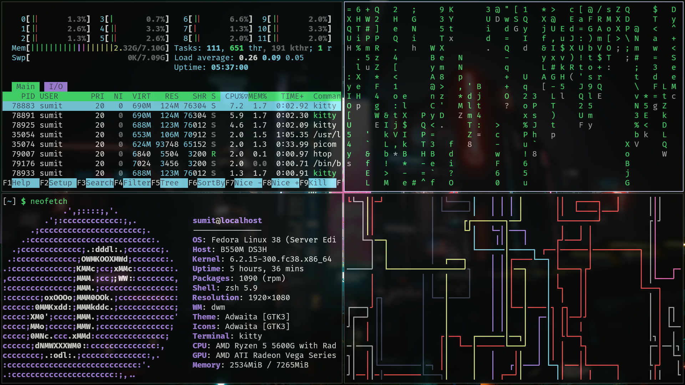
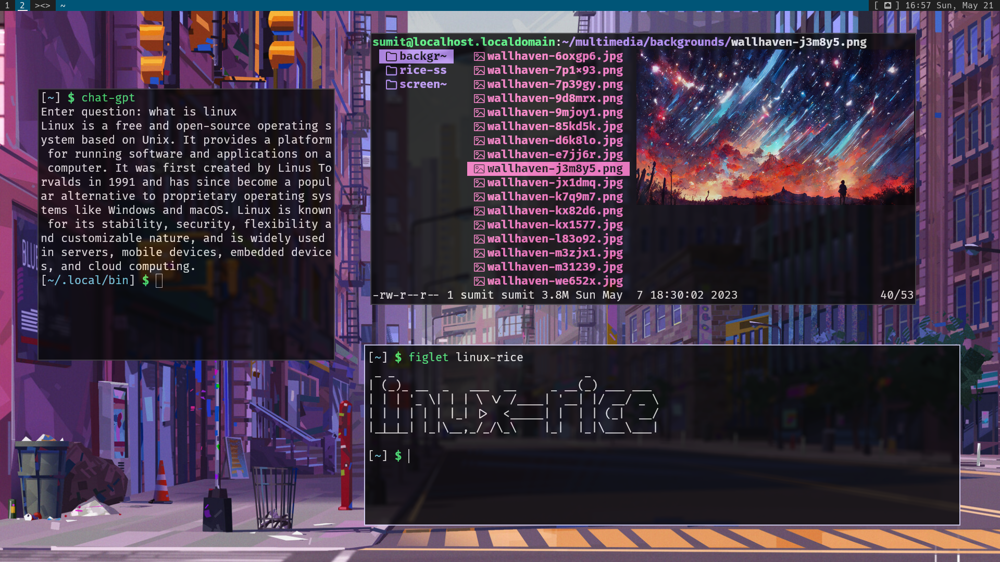

# Linux-Rice

These repository contains scripts and configuration files of those applications which I used to rice linux:

| Applications            | Packages                |
| :---------------------- | :---------------------- |
| shell                   | zsh                     |
| display_render		      | x                       |
| compositor			        | picom                   |
| window_manager          | dwm                     |
| statusbar               | dwm_bar + xsetroot      |
| terminal                | kitty                   |
| application_launcher    | dmenu                   |
| text_editor			        | helix                   |
| file_explorer           | lf                      |
| fonts                   | hack-nerd-fonts         |
| screenshot_tool		      | maim                    |
| background              | xwallpaper              |
| cli_image_preview       | kitty-kitten-icat       |
| sound_drivers			      | pulse_audio             |
| sound_controller		    | pavucontrol             |
| display manager         | slock                   |
| image_viewer			      | sxiv                    |
| video_player			      | mpv 			              |
| audio_player			      | mpd (not included)      |

# Installation

Install latest release of fedora server version and run
```
sudo dnf install git &&
git clone https://github.com/sumit-modak/linux-rice &&
cd linux-rice &&
chmod +x .local/bin/install.sh &&
.local/bin/install.sh
```

For extra installation like (web-browser, system-status, etc) run
```
chmod +x .local/bin/install-extra.sh &&
~/.local/bin/install-extra.sh
```

## Screenshots



# Why fedora is used instead of Arch?
First of all, Fedora is more secure than other linux distributions which led me to use Fedora instead of Arch. Second of all, there are very less rices on fedora because of security restrictions and different package name. So, I have chosen fedora which can work as a guide for others.

## Future-Updates
I will update the install scripts so it can install the same packages in arch, debian/ubuntu, gentoo, void linux, etc.

## Searching for alternative package names
https://github.com/sumit-modak/linux-rice/tree/master/.config/packages 
